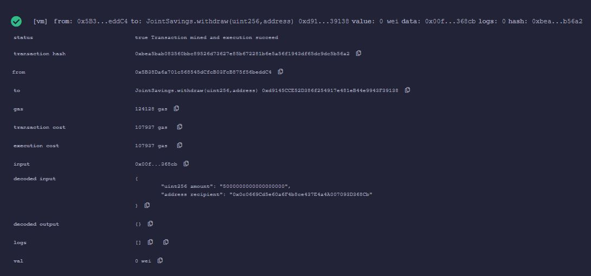
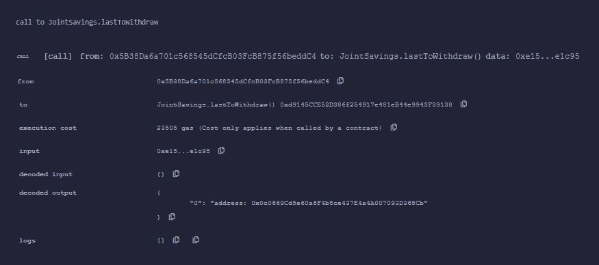
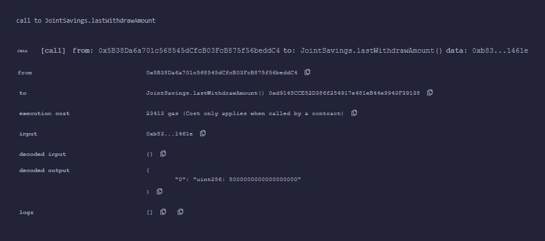

## Module 20 Challenge

In this project, a smart contract is compiled and deployed with the ability to deposit to the contract account and withdraw to 2 additional accounts.  Transactions can be verified by checking which account was the last to make a withdrawal and the amount that was withdrawn.  The contract balance can also be checked after each transaction.

---

## Technologies

This project uses Solidity 0.5.0 or later and was developed in Remix IDE

[Solidity](https://docs.soliditylang.org/en/v0.8.17/)

[Remix IDE](https://remix-project.org/)

---

## Installation Guide

Clone repo

Compile and deploy *joint_savings.sol*

---

## Usage

Dummy accounts were used which can be created at [Vanity-ETH](https://vanity-eth.tk/)

The images below demonstrate the withdraw functions of the contract.

 

Withdraw Amount 5 Ether

Last Account to Make a Withdrawal

Last Amount Withdrawn

---

## Contributors

Dan McQueen

dandmcqueen@gmail.com

[Linkedin](https://www.linkedin.com/in/dan-mcqueen-4a5980238/)

---

## License

[GNU v3.0](LICENSE)
